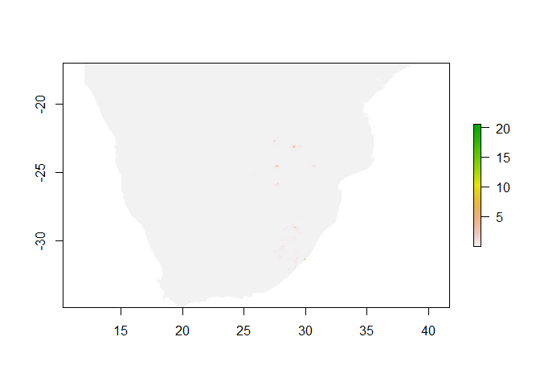

<!-- README.md is generated from README.Rmd. Please edit that file -->

# vultRmap: A package to produce a utilization distribution for the population of Cape Vultures

<!-- badges: start -->
<!-- badges: end -->

This package was developed to provide the necessary functionality to
simulate and map Cape Vulture activity around their known colonies and
roosts, for the paper “A utilization distribution for the global
population of Cape Vultures *Gyps coprotheres* to guide wind energy
development”, *Ecological Applications* (2023). Please, refer to this
article for details on the modelling process and project background.

There is a second repository were you can find all the scripts used for
processing the data and run the models that are used for building the
utilization distribution for the population of Cape Vultures. This
package is used, once models are fitted, to produce a map by simulating
vulture activity with the models outputs. The simulation routines were
packaged and separated from the data processing and fitting routines to
be able to easily update the maps, when more/better information becomes
available. Throughout the publication process, we used different
terminology to refer to the same things.

We had three main objectives in mind when developing this package:

1.  Simulate Cape Vulture activity around known colonies and roosts to
    map a spatially-explicit distribution of activity throughout the
    distribution range of the species.

2.  Provide a relatively user-friendly and reproducible way of updating
    the map when more/better data becomes available.

3.  Provide functionality for exploring this map and certain assumptions
    made during the modelling and simulation of Cape Vulture activity.

**Very important:** to be able to replicate or update the maps produced
for the paper, we need data found in another directory called
`vultRmap_data_aux`. This directory is not included in vultRmap because
it contains sensitive tracking, colony, and supplementary feeding site
data, and it will only be made available via motivated request to
Associate Professor Arjun Amar (<arjun.amar@uct.ac.za>). We totally
support open research, but unfortunately different forms of persecution
are still a sad reality for this Vulnerable species.

With the package, though, we provide some testing data, with simulated
colony and supplementary feeding sites locations. These can be used to
test the functionality of the package.

Finally, note that we started thinking of utilizaton distribution as
being indicative of ‘risk’ and therefore you might find references to
risk in some of the functions. In most cases, when we say ‘risk’ we mean
“utilization distribution”.

## Installation

To install directly from GitHub you need to have the package `remotes`
installed on your local machine. The `vultRmap` package can then be
installed by

``` r
remotes::install_github("patchcervan/vultRmap")
```

Otherwise, you need to download the package as a .zip file by clicking
on the “Code” button on GitHub, then install from the zip file. To do
that, you click on install packages on RStudio and then instead of
“CRAN” you select “package archive file” on “Install from”, and navigate
to the zip file.

## Repository structure

This repository has three main components:

1)  the `vultRmap` package that provides the functionality needed to run
    the analysis scripts,

2)  various analysis scripts with code to produce and updated
    utilization distribution map, which can be found in the `analysis`
    directory, and

*Note:* the most recent utilization distribution maps in raster format,
can be downloaded from the `rasters` directory in the
[cape_vulture_cr](https://github.com/patchcervan/cape_vulture_cr)
repository. The instructions below assume that you have those maps in a
directory called `rasters` in your working directory.

## Visualizing the current utilization distribution maps

The simplest thing one may be interested in is to visualize the most
current version of the population utilization (UD) distribution maps for
the population of Cape Vultures. We say ‘the most recent’ because these
maps may change as more or better data becomes available. The procedure
for updating the maps is described in the sections below.

In the `rasters` directory we find four rasters containing: 1)
`ud_total` - the expected UD around Cape Vulture colonies assuming a
single individual per colony, 2) `ud_hgt_total` the expected UD around
these colonies accounting for the number of individuals expected to use
each colony (population utilization distribution, large colonies
accumulate more activity than small ones), 3) `pud_total` and 4)
`pud_hgt_total` same as 1) and 2) respectively, but considering only
vulture activity below 300 meters.

Raster files can easily be visualized using the raster package, for
example:

``` r
library(raster)

# visualize PUD
pud <- raster("rasters/pud_total.tif")

plot(pud)
```



However, UD is tipically very skewed and certain areas present extremely
large values compared to others. To appreciate the gradient in activity
better we can plot the cumulative UD. The advantage of this is that it
is easily interpreted. Contours of the cumulative distribution enclose
the corresponding percentage of the population of Cape Vultures. For
example, we can draw a contour along the median value of the cumulative
distribution to enclose 50% of the population or we can use the 0.9
quantile to enclose 90% of the population, etc.

``` r
library(vultRmap)

# Calculate the population cumulative distribution and divide it in 10 equal parts
cum_pud <- makeBinnedRasterMap(pud, nlevels = 10, cutoff = 1)

# makeBinnedRasterMap() is a convinience function of the vultRmap package

# Crop map to make it nicer
frame <- extent(c(12, 40, -37, -17))
cum_pud <- crop(cum_pud, frame)

# visualize cumulative PUD
plot(cum_pud)
```


With a bit of work we can make it nicer

``` r
library(sf)
library(ggplot2)
library(rnaturalearth)

# Download South Africa map with Lesotho and Swaziland
ssa_map <- ne_countries(scale = 50, continent = "Africa", returnclass = "sf")

# Crop ssa_map
sf_use_s2(FALSE) # There are some problematic vertices to use spherical geometry, so we switch it off
ssa_map <- st_crop(ssa_map, frame)
#> Warning: attribute variables are assumed to be spatially constant throughout all
#> geometries

# Plot
as.data.frame(cum_pud, xy = TRUE) %>%
  ggplot() +
  geom_raster(aes(x = x, y = y, fill = layer)) +
  geom_sf(data = ssa_map, fill = NA, size = 0.05) +
  scale_fill_viridis_c(name = "UD", option = "inferno", direction = 1, na.value = NA) +
  xlab("") + ylab("") +
  theme_bw() +
  theme(axis.text = element_text(size = 8),
        legend.text = element_text(size = 10),
        strip.text = element_text(size = 10))
#> Warning: Removed 1919387 rows containing missing values (geom_raster).
```


## Calculating the population proportion exposed in an area

One of the main goals of this work is to help in the assessment of the
risk posed by wind energy facilities and other human infrastructure to
the population of Cape Vultures.

The population utilization distribution maps provide an idea of the
expected number of individuals potentially found at any location, at any
given time. With this information, we can also calculate the number of
individuals expected to use a region and the proportion of individuals
in a region relative to a larger reference area. These two metrics are
useful to evaluate the magnitude of the expected impact of the
infrastructure, or at least to compare competing alternatives, by
looking that the proportion of the population of Cape Vultures exposed.

In the `vultRmap` package there is a convenience function that does most
of the work for us. Say we are interested in the number of individuals
expected in Western Cape of South Africa, and in the proportion of the
total population that these represent.

``` r
library(raster)
library(dplyr)
library(sf)
library(rnaturalearth)

# Load PUD map
pud <- raster("rasters/pud_total.tif")

# Load a map with the South African provinces
sa_map <- ne_states(country = "South Africa", returnclass = "sf")

# Extract number of Cape Vultures expected in the Western Cape of South Africa
wc_prov <- sa_map %>% 
  filter(name == "Western Cape") %>% 
  dplyr::select(name)

calcRegionRisk(region = wc_prov, ref_area = NULL, ud_map = pud)
#> Simple feature collection with 1 feature and 4 fields
#> Geometry type: MULTIPOLYGON
#> Dimension:     XY
#> Bounding box:  xmin: 17.76711 ymin: -46.96575 xmax: 37.97779 ymax: -30.47075
#> CRS:           +proj=longlat +datum=WGS84 +no_defs +ellps=WGS84 +towgs84=0,0,0
#>           name pud_total     pud_avg     pud_sd                       geometry
#> 1 Western Cape  299.0528 0.002401972 0.02410036 MULTIPOLYGON (((23.63551 -3...

# Extract number of Cape Vultures expected in South Africa
sa_map_union <- sa_map %>% 
  st_crop(xmin = 0, ymin = -35, xmax = 40, ymax = -15) %>%  # Removing some of the islands
  mutate(un = 1) %>%     # aux variable to join polygons
  group_by(un) %>% 
  st_union() %>% 
  st_sf()
#> Warning: attribute variables are assumed to be spatially constant throughout all
#> geometries

calcRegionRisk(region = sa_map_union, ref_area = NULL, ud_map = pud)
#> Simple feature collection with 1 feature and 3 fields
#> Geometry type: POLYGON
#> Dimension:     XY
#> Bounding box:  xmin: 16.46998 ymin: -34.82195 xmax: 32.89308 ymax: -22.12645
#> CRS:           +proj=longlat +datum=WGS84 +no_defs +ellps=WGS84 +towgs84=0,0,0
#>   pud_total    pud_avg    pud_sd                       geometry
#> 1  13430.27 0.01188389 0.1720107 POLYGON ((23.38689 -34.0311...

# This is now trivial, but extract proportion of Cape Vultures expected in Western Cape relative to South Africa
calcRegionRisk(region = wc_prov, ref_area = sa_map_union, ud_map = pud)
#> Simple feature collection with 1 feature and 5 fields
#> Geometry type: MULTIPOLYGON
#> Dimension:     XY
#> Bounding box:  xmin: 17.76711 ymin: -46.96575 xmax: 37.97779 ymax: -30.47075
#> CRS:           +proj=longlat +datum=WGS84 +no_defs +ellps=WGS84 +towgs84=0,0,0
#>           name pud_total     pud_avg     pud_sd   pud_prop
#> 1 Western Cape  299.0528 0.002401972 0.02410036 0.02227148
#>                         geometry
#> 1 MULTIPOLYGON (((23.63551 -3...
```

## Running analysis scripts

The utilization distribution of Cape Vultures are produced by simulating
based on habitat preferences and movement constraints identified by a
step-selection model. The simulation routines can be found in the
`analysis/update_ALL` directory.

Simulations are computationally very intensive and it is recommended to
run them in a high performance cluster. We used a 20 core machine and
200GB of RAM to run simulations for all colonies and it took a couple of
days to run.

Also, remember that to be able to run these routines, we need the data
contained in `vultRmap_data_aux`.

Once all the pre-requirements are met, we can start producing maps.
Paths to specific directories need to be adapted to the user
configuration. This is true also for the code contained in the scripts.

### Predicting utilization distributions

``` r

# Run simulations around all identified colonies
source("analysis/update_ALL/1_ssf_sims_all.R")

# Predict flight height for simulated Cape Vulture locations
source("analysis/update_ALL/1_hgt_risk_all.R")

# Smooth utilization distribution using GAMs
source("analysis/update_ALL/3_ssf_gam_all.R")

# Smooth utilization distribution at collision risk height GAMs
source("analysis/update_ALL/4_hgt_gam_all.R")
```

### Producing utilization distribution maps

``` r

# Compute cumulative UD and produce raster maps
source("analysis/update_ALL/5_make_all_risk_maps.R")

# Save maps in HTML formats
source("analysis/update_ALL/6_make_all_html_maps.R")
```

### Updating utilization distribution maps

If new colony and/or roost data is collected, the first thing we need to
do, before updating the utilization distribution maps, is to update our
colony database.

At this point is really IMPORTANT TO MAKE A COPY OF THE COLONY DATABASE
BEFORE MAKING ANY CHANGES. The following procedures will modify the
database without the possibility of going back to what it was.

The function `updateColonyCount()` is the workhorse function to update
colony data. See `help(updateColonyCount)` for details.

The script `vultRmap/analysis/0_colony_updates/` is used to keep track
of the updates made to the database so far. In this file there are some
examples of updates that had be done before the paper was published.

Once the updates to the colony database are completed, we must proceed
to produce new Cape Vulture activity simulations for those colonies that
we need updates for.

The procedure for simulating around new colonies would be the same used
in the previous section. However, in this case we will have to specify
the colonies we want to simulate activity for. For this we go to
`vultRmap/analysis/update_ONE` and run the two scripts in this
directory, modifying the functions `1_ssf_sim` and `2_hgt_sim` to
specify the colony codes we want simulations for. For example, the
following code will simulate activity around colonies “cvcol009” and
“cvcol115”.

``` r
sim_ssf(colonies = c("cvc009", "cvcol115"),
        out_dir = "/home/vultRmap/sims",
        data_dir = "/home/vultRmap_data_aux",
        seeds = c(6548, 89745),
        totalsteps = 1000,
        ncores = 4,
        dist_lim = 500,
        sample_coefs = 4)
```

Similarly, this code will simulate flight height for the activity
simulations

``` r
sim_height_risk(colonies = c("cvc009", "cvcol115"),
                data_dir = "../vultRmap_data_aux/",
                sims_dir = "../vultRmap_data_aux/col_sims/",
                out_dir = "../vultRmap_data_aux/col_hgt_sims/",
                ncoefs = 40,
                seed = 87634)
```

As previously mentioned, activity simulations are computationally
demanding, so both scripts use the capabilities of the `furrr` package
to run the simulations in parallel. It is recommended to use a machine
with at least 4 cores and 16 GB of RAM for running simulations for
individual colonies.

After simulating activity for the new colonies, we need to smooth the
UDs for all colonies combined, just as we did earlier.

``` r

# Smooth utilization distribution using GAMs
source("analysis/update_ALL/3_ssf_gam_all.R")

# Smooth utilization distribution at collision risk height GAMs
source("analysis/update_ALL/4_hgt_gam_all.R")
```

And produce the utilization distribution maps with the new information.

``` r

# Compute cumulative UD and produce raster maps
source("analysis/update_ALL/5_make_all_risk_maps.R")

# Save maps in HTML formats
source("analysis/update_ALL/6_make_all_html_maps.R")
```

### Fun with vultRsims

The Shiny App `vultRsims` can be used to explore the workings of these
simulation routines in a relatively user-friendly way. The app is in the
`analysis` directory and with it you can simulate vulture activity using
simulated colony and supplementary feeding site data. You can also
change some of the simulation parameters to investigate their effects in
the results. The only difference is that the final utilization
distribution is calculated using the kernel density estimate of the
simulated points rather than counting visits to square grid cells,
smoothing, etc.
